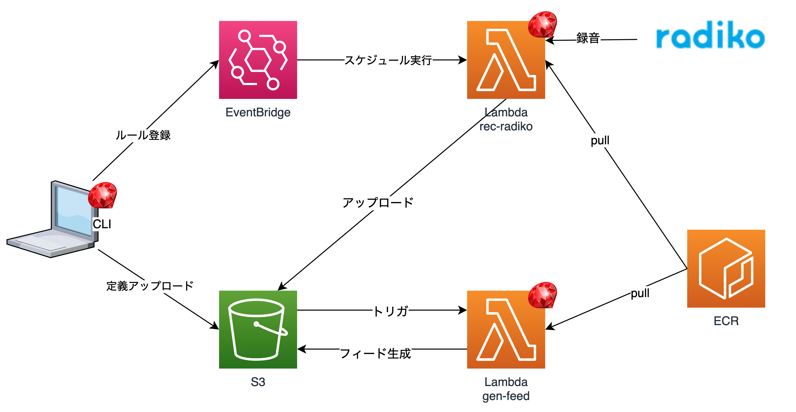

**Please do not use this project for commercial use. Only for your personal, non-commercial use.**</br>
**個人での視聴の目的以外で利用しないでください.**

# radicaster

radicasterはAWSの各種マネージサービスを活用し、radikoのお好きな番組を録音・Podcast化するアプリケーションです。

## 特徴

- FaaSを活用したアーキテクチャにより低コストで運用可能
    - 普通の使い方であればストレージ以外はほぼ無料
- AWS CDKによる簡単なデプロイ
- 分割された番組の結合に対応
- HTTPS+Basic認証によるフィードの保護
- 独自ドメインを使用可能

## 構成



### 主な使用サービス

- Lambda
- EventBridge
- S3
- CloudFront

## デプロイ方法(WIP)

### 事前準備

#### リポジトリのclone

```bash
git@github.com:l3msh0/radicaster.git
```

#### AWSプロファイルの準備

デプロイに使用するAWSアカウントやリージョンは、 `AWS_ACCESS_KEY_ID` や `AWS_REGION` などの環境変数でも指定できますがプロファイルを使用することを推奨します。

プロファイルの設定を行い、後続の作業は環境変数 `AWS_PROFILE` にプロファイル名をセットした上で実行してください。

#### AWS CDKのインストール

デプロイにはAWS CDKを使用します。以下のコマンドを実行しでCDKをインストールしてください。

```bash
npm install -g aws-cdk
```

AWS CDKについての詳細は[AWSのドキュメント](https://docs.aws.amazon.com/cdk/latest/guide/getting_started.html)を参照してください。

#### CDK bootstrap

CDKによるデプロイを行うにあたって、事前にbootstrapという作業が必要となります。
以下のコマンドを実行してbootstrapを行ってください。

```bash
cdk bootstrap aws://<AWSのアカウントID>/us-east-1 aws://<AWSのアカウントID>/ap-northeast-1
```

参考
- [Bootstrapping - AWS Cloud Development Kit (CDK)](https://docs.aws.amazon.com/cdk/latest/guide/bootstrapping.html)

### 環境変数の準備

cloneしたリポジトリ直下にある `.env.example` ファイルをコピーし、コメントに従って必要な値を入力します。

```bash
cp .env.example .env
vim .env
```

一通り入力ができたら、sourceコマンドでファイルに記載された環境変数を現在のシェルにセットします。

```bash
source .env
```

### CDK実行

CDKを実行し、AWS上にradicasterが使用するリソースを作成します。

```bash
export AWS_PROFILE=AWSプロファイル名
cd deployment
cdk deploy --all
```

### 環境変数の更新

CDKを実行すると実行結果のOutputsが出力されます。その中から `RadicasterStack.RecRadikoARN` の値をコピーし、.envの `RADICASTER_REC_RADIKO_ARN` の値にセットしてください。

CDK実行結果の例
```
Outputs:
RadicasterStack.RecRadikoARN = arn:aws:lambda:ap-northeast-1:xxxxxxxxxxxx:function:radicaster-rec-radiko
RadicasterStack.domainName = https://xxxxxxxxxxxxxx.cloudfront.net
```

## 録音方法

### 定義ファイルを作成する

以下のフォーマットで、Podcast化したい番組の情報を記述します。

```yaml
id: example                                       # 番組ID: 番組を一意に識別する文字列で、AWSの各種リソースの命名やURLなどに使用されます
title: テスト番組                                   # 番組名: 生成されるPodcastフィードの番組名に使用されます
author: テスト太郎                                  # 作者: 生成されるPodcastの作者フィールドに使用されます
image: http://www.tbsradio.jp/ijuin/300_300.jpg   # 画像: Podcastの番組サムネイルに使用する画像のURLを指定します
area: JP13                                        # エリアID: 録音対象のradikoのエリアIDを指定します。デプロイ時にradikoプレミアムの認証情報を指定しない場合はJP13のみ指定できます。
station: TBS                                      # 放送局: 録音対象の放送局を指定します
program_schedule: Tue 01:00:00                    # 番組開始日時: 録音対象番組の放送開始曜日と時間を指定します
execution_schedule: Tue 03:03:00                  # 録音開始日時: 録音を実行する曜日と日時を指定します
```

### 録音を予約する

環境変数 AWS_PROFILE に、デプロイを実行したプロファイルがセットされている状態で以下のコマンドを実行します。

```
$ cd cli
$ ./bin/radicaster example.yaml
```

上記のコマンドを実行すると、定義ファイルの内容に基づいて以下の処理が行われます。

- 録音ファイル出力先のS3バケットに定義ファイルをアップロード
- EventBridge へ録音の定期実行ルールを登録

### フィードを購読

デプロイが正常に行われていれば、最初の録音が行われた後に所定のURLにPodcastのフィードが生成されるので、お好みのPodcastアプリでフィードを購読します。

以上で作業は完了です。スケジュールに従って録音が行われる度に、新しいエピソードがフィードに追加されていきます。


(TODO) Basic認証が必要なフィードの購読について
